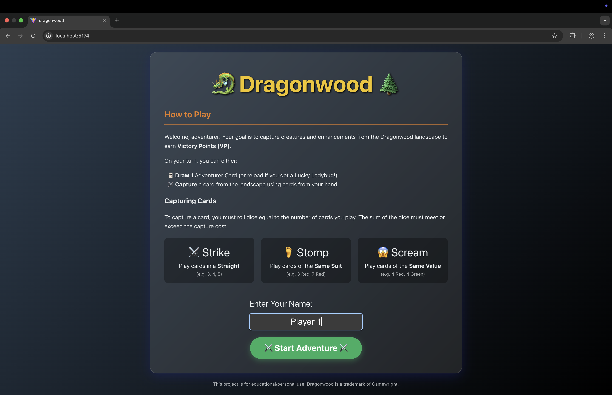

# Dragonwood (Digital Version) 🐉🌲

A web-based implementation of the popular Dragonwood board game, built with React, TypeScript, and Vite.

This application was built over the course of an afternoon utilizing [Google Antigravity](https://antigravity.google/).

## Overview

Explore the enchanted forest of Dragonwood! Collect adventurer cards to earn dice, which you use to roll against your foes. Stomp on some Fire Ants, scream at a Grumpy Troll, or strike at a menacing Dragon. The goal is to capture creatures and enhancements to earn the most Victory Points.




## Features implemented

- **Core Gameplay Loop**: Draw cards, manage your hand, and capture landscape cards.
- **Three Attack Types**:
    - ⚔️ **Strike**: Straight (Sequential numbers, e.g., 1, 2, 3)
    - 🦶 **Stomp**: Flush (Same color, e.g., all Red)
    - 😱 **Scream**: Kind (Same value, e.g., all 4s)
- **Enhancements**: Capture magical items like the *Silver Sword*, *Magical Boots*, *Cloak of Darkness*, and *Honey Pot* to gain permanent bonuses to your rolls.
- **Special Mechanics**:
    - **Lucky Ladybug 🐞**: Immediately draw 2 extra cards when drawn.
    - **Honey Pot 🍯**: Automatically re-rolls any 1s rolled on dice.
    - **Penalty Discard**: If you fail a capture, you must discard one adventurer card as a penalty.
- **Bot Opponent 🤖**: Play against a simple AI that draws cards and competes for points (basic implementation).
- **Dynamic UI**:
    - Real-time score and bonus display.
    - Detailed game log with history.
    - Visual indicators for enhancements and dice rolls.
    - Player renaming.

## Tech Stack

- **Frontend**: React 19, TypeScript
- **Build Tool**: Vite
- **Styling**: CSS (Modules/Inline)
- **State Management**: Custom GameEngine with Observer pattern

## Getting Started

### Prerequisites

- Node.js (Latest LTS recommended)
- npm

### Installation

1.  Clone the repository:
    ```bash
    git clone git@github.com:andrew-mcgrath/dragonwood.git
    cd dragonwood
    ```

2.  Install dependencies:
    ```bash
    npm install
    ```

3.  Run the development server:
    ```bash
    npm run dev
    ```
    OR
    ```bash
    npx vite
    ```

4.  Open your browser and navigate to `http://localhost:5173` (or the port shown in your terminal).

### Running with Docker

1.  Make sure you have Docker installed.
2.  Run with Docker Compose:
    ```bash
    docker compose up --build -d
    ```
3.  Open browser at `http://localhost:8080`.

## How to Play

1.  **On your turn**, you can either:
    - **Draw a Card**: Click "Draw Card" to add to your hand.
    - **Capture**: Select a card in the **Landscape** (top row) and select cards from your **Hand** (bottom row) that form a valid attack (Strike, Stomp, or Scream). Then click the corresponding action button.
2.  **Dice Roll**: The game calculates your dice count (1 per card + bonuses). If your total roll meets or exceeds the capture cost, you win the card!
3.  **End of Game**: The game ends when both decks are empty or the Dragonwood deck is empty (Standard rules apply).

## License

This project is for educational/personal use. [Dragonwood](https://gamewright.com/product/Dragonwood) is a copyright of [Gamewright](https://gamewright.com/).
